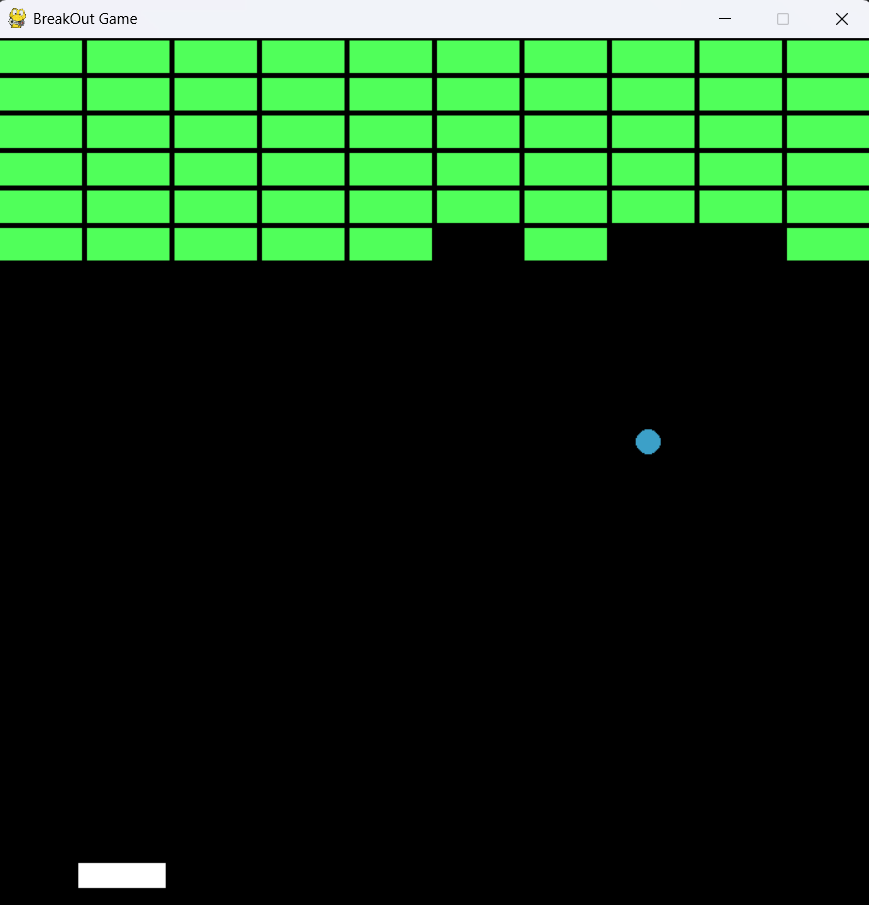

# Breakout Game

A simple Breakout Game developed using Python and Pygame. The player controls a paddle to bounce the ball and destroy all the bricks. The game ends when the ball falls below the paddle, and the player wins when all bricks are destroyed.

## Features

* Brick wall with 10 columns and 6 rows
* Player-controlled paddle
* Moving ball with collision detection
* Left and right keyboard controls
* Brick collision and destruction
* Win screen when all bricks are destroyed
* Game Over screen when the ball falls below the screen
* Runs at 60 FPS
* 700 × 700 game window

## Technologies Used

* Python
* Pygame

## Project Structure

```text
Breakout-Game/
│
├── breakout.py
└── README.md
```

## Requirements

Make sure Python is installed on your system.

Install Pygame using:

```bash
pip install pygame
```

## How to Run

1. Clone the repository:

```bash
git clone https://github.com/your-username/Breakout-Game.git
```

2. Navigate to the project folder:

```bash
cd Breakout-Game
```

3. Install the required package:

```bash
pip install pygame
```

4. Run the game:

```bash
python breakout.py
```

## Controls

| Key          | Action            |
| ------------ | ----------------- |
| Left Arrow   | Move paddle left  |
| Right Arrow  | Move paddle right |
| Close Window | Exit game         |

## How to Play

1. Start the game.
2. Use the Left and Right Arrow keys to move the paddle.
3. Keep the ball from falling below the paddle.
4. The ball bounces off the paddle, walls, and bricks.
5. Destroy all the bricks to win the game.
6. If the ball falls below the screen, the game displays "GAME OVER".

## Game Components

### Brick Class

The `Brick` class creates and draws the brick wall. The game uses 10 columns and 6 rows, creating a total of 60 bricks.

### Paddle Class

The `Paddle` class controls the player's paddle. It starts near the bottom of the screen and can be moved using the left and right arrow keys.

### Ball Class

The `Ball` class handles the ball's movement and collision detection with the walls, paddle, and bricks.

### Game Status

The game uses three different statuses:

* `0` - Game is running
* `1` - Player won
* `-1` - Game over

The game displays the "YOU WON" or "GAME OVER" screen based on the game status.

## Screenshots

Add screenshots of your game here:




## Future Improvements

* Score system
* Multiple lives
* Sound effects
* Background music
* Different brick colors
* Increasing ball speed
* Multiple levels
* Pause and Resume option
* High-score system

## Author

**Sabarinathan**

Built using Python and Pygame.
